# Live System Build Guide - version 1

## 1. Machine Preparation
-------------------------------------------------------

### Step 1:

Install the live-build tool (this step need to be run with "sudo"):  
Either log in using "root" :  
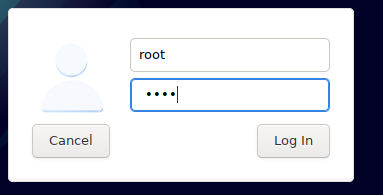

or use <code>su -l</code> in default user account and enter sudo password when prompted:  
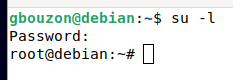

Then run the following commands:  
<code>apt-get install live-build</code>  
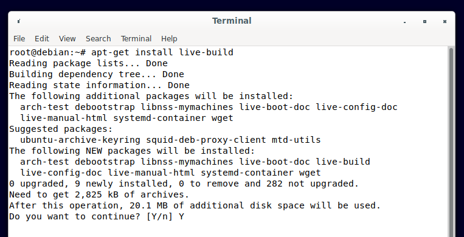  

<code>apt-get install squashfs-tools syslinux-common syslinux-utils xorriso isolinux</code>  
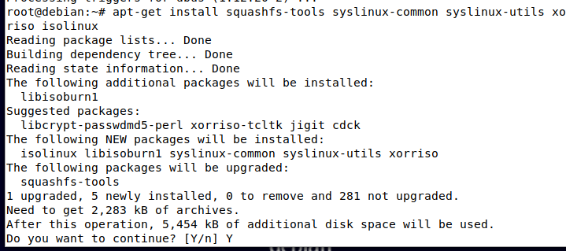  

-------------------------------------------------------

### Step 2

Create a prep directory in home (/root) folder. 
Naming it differently will require customizing the instructions.

This is the folder that will contain all customizations for your system

Do <code>mkdir prep</code> or just right click the root directory -> Create New Folder  

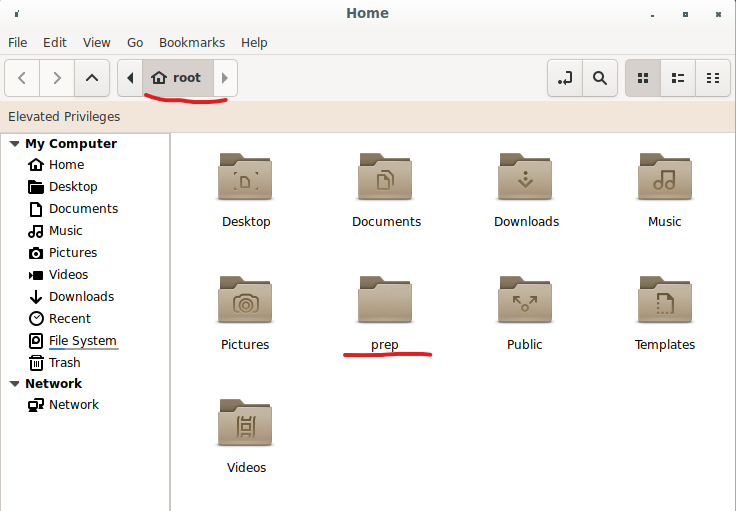  

-------------------------------------------------------

## Step 3

Collect all background images, especially the current background, and copy them to a folder inside /prep.

This is assuming you already have a folder with the background you want prepared in the root directory.

If you don't, create a folder named <b>backgrounds</b> and add your background images to it.

Do <code>cp -r backgrounds /prep/backgrounds</code> or simply copy the backgrounds folder into the prep folder manually  
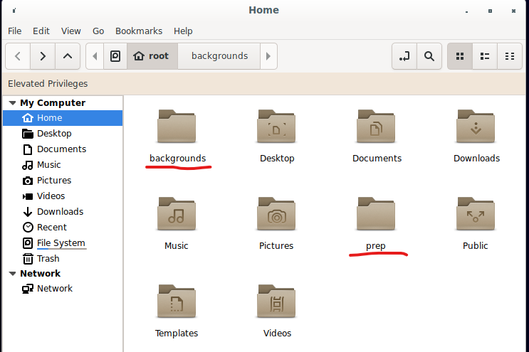  

After you run this command, your prep folder should contain a folder called backgrounds (which contains the images you previously added)

-------------------------------------------------------

## Step 4

Configure your desktop settings exactly the way you want to preserve them for the live system.  
If using XFCE, all of these settings are stored in ~/.config/xfce4.  
If using another Desktop environment, research the path for the config and use <i>that</i> instead.  

Copy that folder inside /prep: <code>cp -r ~/.config/xfce4 ~/prep/</code> or do it manually with copy paste.  

After you run this command, your prep folder should now contain <b>backgrounds</b> folder and <b>xfce4</b> folder.

-------------------------------------------------------

## Step 5 (optional)

Copy other deb packages into the /prep/misc64 folder if you have any

-------------------------------------------------------

## Step 6 (optional)

If you have any shell scripts, place them in the /prep/scripts folder.  
If you have any icons, place them in the /prep/icons folder.  
If you have any hooks, place them in the /prep/hooks folder.  
If you have any documentation, place the it in the /prep/doc folder.  

-------------------------------------------------------

## Step 7

The /bootloaders directory is found in /usr/share/live/build/ -> copy the folder into your /prep/ directory:  
<code> cp -r /usr/share/live/build/bootloaders /prep/bootloaders</code>

Inside each of the subfolders within /bootloaders is a file named: splash.svg or splash.png. These are default images and can be replaced. Use whatever graphic program you like to create or edit an image for use as your boot splash (aka the image that shows when you open the iso, either using a virtual machine or during the actual installation of the system). Any text you place on the image should be in the upper portion of the image - the lower half will display the boot menu. When you are satified with your image, save it as a 640x480 pixel PNG graphic file named splash.png. Copy the file into each of the subfolders of /bootloaders with the exception of the grub-legacy folder. Grub-legacy will probably never be used, but if you want to replace that image, save a copy of your splash image as a 640x480 pixel XPM graphic file and name it splash.xpm. You will need to gzip the splash.xpm file and replace the default file in the grub-legacy subfolder.

-------------------------------------------------------

### prepare-howto.txt -- Revision: 111r1 -- by eznix (https://sourceforge.net/projects/eznixos/) -> (GNU/General Public License version 3.0)

## 2. Live Build - AMD64 Architectire
-------------------------------------------------------

Suggested location for the build staging folder: (/root/vanierOS)

  /vanierOS -- build folder

Suggested location for the collection of preparation files and packages: (/root/prep)

  /prep  -- files location (this is the prep folder)

The build procedure begins below.  
Copy and paste each command exactly unless you know what you are doing and are comfortable making changes.

<b>ALL COMMANDS NEED TO BE RUN AS ROOT! -> su -l</b>

-------------------------------------------------------

### Step 1: Assign the variable WKDIR the output of pwd 

Run command below to set the working directory:

<code>WKDIR="$(pwd)"</code> -> <code>echo $WKDIR</code> should result in /root  

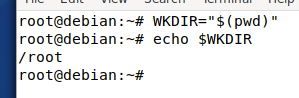  

Create <i>prep</i> and <i>vanierOS</i> (build) folders in /root directory for the rest of these commands to work.  

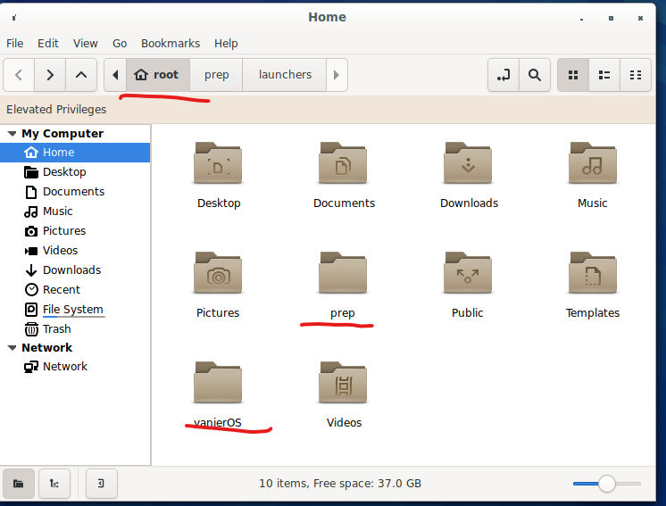  

At the end of these steps, your prep folder should contain the following folders:  
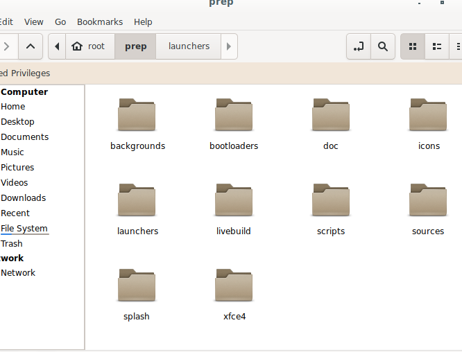  

Observations:   

Note that the splash, doc, livebuild and scripts folders are <i>not</i> needed but are there to add further customization and features to the system. 

The only needed folders are the desktop configs \(in our case xfce4 folder\), bootloaders, launchers and sources folders. If the other folders are there but are empty, it will also not affect the build/system itself.

-------------------------------------------------------

### Step 2: preparing the build

Remove the icon cache cleaning hook:  

<code>[[ -f /usr/share/live/build/hooks/normal/0130-remove-gnome-icon-cache.hook.chroot ]] && rm /usr/share/live/build/hooks/normal/0130-remove-gnome-icon-cache.hook.chroot</code>  
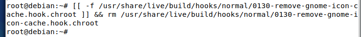  

Create build staging folder, if not already created in previous step: <code>mkdir vanierOS</code>  

Run the following commands from inside the build staging folder (aka cd into it): <code>cd vanierOS</code>  

Working directory should now be /root/vanierOS:  

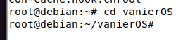  

-------------------------------------------------------

### Step 3: configure live build

Note: this sets the iso preparer and iso publisher as vanierfloss and the link as our vanierOS GitHub repository.   

Run following command to configure the live build:  

<code>lb config --binary-images iso-hybrid --mode debian --architectures amd64 --linux-flavours amd64 --distribution bullseye --archive-areas "main contrib non-free" --updates true --security true --cache true --apt-recommends true --debian-installer live --debian-installer-gui true --win32-loader false --iso-application vanierOS --iso-preparer vanierfloss-https://github.com/gbouzon/vanierOS --iso-publisher vanierfloss-https://github.com/gbouzon/vanierOS --iso-volume vanierOS</code>  

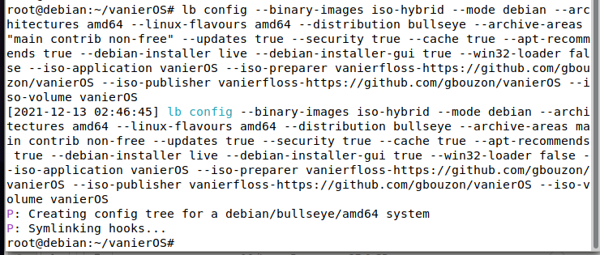  

Another note:  
If the Debian Installer does not work, try inserting 	<code>--debian-installer-distribution daily</code> into the lb config options

-------------------------------------------------------

### Step 4: Pass the desktop and packages to the live-build config

Run the following command to install the xfce desktop:  

<code>echo task-xfce-desktop > $WKDIR/vanierOS/config/package-lists/desktop.list.chroot</code>  

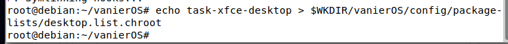  

Run command below to install tons of software (You can modify and download the software you want -> only ones allowed in this list are the ones in the official debian packages (meaning you can do apt-get install \<name of software\> in the terminal)   

Note: if the software is not part of the official Debian Packages, you can use snap packages (check the snapstore online to see if the software exists as a snap package). If not, you can also write a script to install the software and the include that in the scripts folder.  

<code>echo "haveged less gdebi galculator grsync synaptic gparted bleachbit flac faad faac mjpegtools x265 x264 mpg321 ffmpeg streamripper sox mencoder dvdauthor twolame lame asunder aisleriot dosbox filezilla libxvidcore4 vlc soundconverter hplip-gui cdrdao frei0r-plugins htop jfsutils xfsprogs ntfs-3g cdtool mtools clonezilla testdisk numix-gtk-theme greybird-gtk-theme breeze-icon-theme breeze-gtk-theme xorriso cdrskin p7zip-full p7zip-rar hardinfo inxi gnome-disk-utility simplescreenrecorder thunderbird simple-scan gthumb remmina arc-theme gstreamer1.0-plugins-bad gstreamer1.0-plugins-ugly gstreamer1.0-plugins-good gnome-system-tools dos2unix dialog papirus-icon-theme transmission-gtk rar unrar cifs-utils fuse3 gvfs-fuse gvfs-backends gvfs-bin pciutils squashfs-tools syslinux syslinux-common dosfstools isolinux live-build fakeroot linux-headers-amd64 lsb-release menu build-essential dkms curl wget iftop apt-transport-https dirmngr nvidia-detect openvpn network-manager-openvpn openvpn-systemd-resolved libqt5opengl5 neofetch firmware-linux firmware-linux-nonfree firmware-misc-nonfree firmware-realtek firmware-atheros firmware-bnx2 firmware-bnx2x firmware-brcm80211 firmware-ipw2x00 firmware-intelwimax firmware-iwlwifi firmware-libertas firmware-netxen firmware-zd1211 gnome-nettool guvcview snapd git libreoffice vim plank" > $WKDIR/vanierOS/config/package-lists/packages.list.chroot</code>

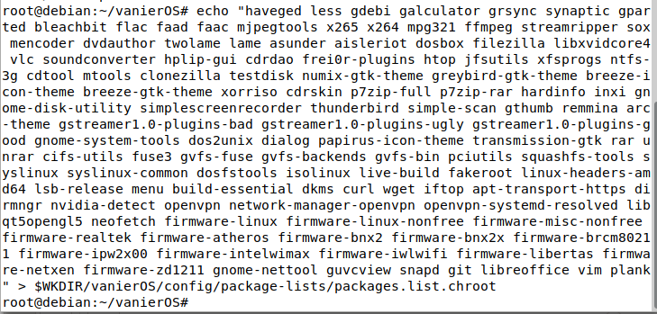  

Run command below to install EFI boot loader packages:  

<code>echo "grub-common grub2-common grub-pc-bin efibootmgr grub-efi-amd64 grub-efi-amd64-bin grub-efi-amd64-signed grub-efi-ia32-bin libefiboot1 libefivar1 mokutil shim-helpers-amd64-signed shim-signed-common shim-unsigned" > $WKDIR/vanierOS/config/package-lists/grubuefi.list.binary</code>

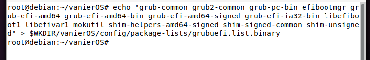  

Run command below to include Broadcom wireless drivers:  

<code>echo "b43-fwcutter firmware-b43-installer firmware-b43legacy-installer" > $WKDIR/vanierOS/config/package-lists/wifidrivers.list.chroot</code>

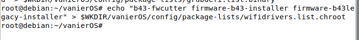  

Note:  
You may add or remove from these packages as needed, just make sure to test it in the terminal beforehand to make sure all works properly.

-------------------------------------------------------

### Step 5: creating build folders

Run commands below to create the needed folders in the build folder (vanierOS in our case):

<code>mkdir -p $WKDIR/vanierOS/config/includes.chroot/usr/share/vanierOS</code>  
<code>mkdir -p $WKDIR/vanierOS/config/includes.chroot/etc/skel/.config</code>  
<code>mkdir -p $WKDIR/vanierOS/config/includes.chroot/usr/share/backgrounds</code>  
<code>mkdir -p $WKDIR/vanierOS/config/includes.chroot/usr/share/icons/default</code>  
<code>mkdir -p $WKDIR/vanierOS/config/includes.chroot/usr/local/bin</code>  
<code>mkdir -p $WKDIR/vanierOS/config/includes.chroot/usr/share/applications</code>  
<code>mkdir -p $WKDIR/vanierOS/config/includes.chroot/usr/share/doc/vanierOS</code>  
<code>mkdir -p $WKDIR/vanierOS/config/includes.chroot/etc/skel/Desktop </code> -> skel "skeleton" refers to user folders  
<code>mkdir -p $WKDIR/vanierOS/config/includes.chroot/etc/live/Desktop </code> -> live here refers to when user chooses the live system option instead of graphical installer  

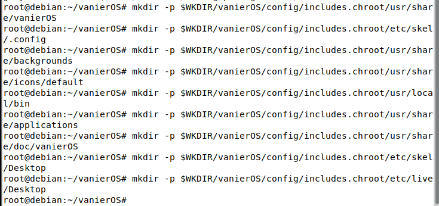  

-------------------------------------------------------

### Step 6: copy files from prep into build -> final preparation

Run the following commands to copy build files into the live system:

<code>cp -r $WKDIR/prep $WKDIR/vanierOS/config/includes.chroot/usr/share/vanierOS/ </code>  
<code>cp -r $WKDIR/prep/bootloaders $WKDIR/vanierOS/config/ </code>  
<code>cp -r $WKDIR/prep/xfce4 $WKDIR/vanierOS/config/includes.chroot/etc/skel/.config/ </code>  
<code>cp -r $WKDIR/prep/xfce4 $WKDIR/vanierOS/config/includes.chroot/etc/live/.config/ </code>  
<code>cp $WKDIR/prep/scripts/* $WKDIR/vanierOS/config/includes.chroot/usr/local/bin/ </code>  
<code>cp $WKDIR/prep/doc/* $WKDIR/vanierOS/config/includes.chroot/usr/share/doc/vanierOS/ </code>  
<code>cp $WKDIR/prep/backgrounds/* $WKDIR/vanierOS/config/includes.chroot/usr/share/backgrounds/ </code>  
<code>cp $WKDIR/prep/icons/* $WKDIR/vanierOS/config/includes.chroot/usr/share/icons/default/ </code>  
<code>cp $WKDIR/prep/launchers/ezadmin.desktop $WKDIR/vanierOS/config/includes.chroot/usr/share/applications/ </code>  
<code>cp -r $WKDIR/prep/scripts2 $WKDIR/vanierOS/config/includes.chroot/usr/share/ </code> -> contains my snap packages scripts  
<code>ln -s /usr/share/doc/vanierOS $WKDIR/vanierOS/config/includes.chroot/etc/skel/Desktop/ </code>  
<code>ln -s /usr/share/doc/vanierOS $WKDIR/vanierOS/config/includes.chroot/etc/live/Desktop/</code>  
<code>ln -s /usr/share/scripts2 $WKDIR/vanierOS/config/includes.chroot/etc/skel/Desktop/ </code> -> contains my snap packages scripts  
<code>ln -s /usr/share/scripts2 $WKDIR/vanierOS/config/includes.chroot/etc/live/Desktop/</code>  

The vanierOS folder should look like this:  
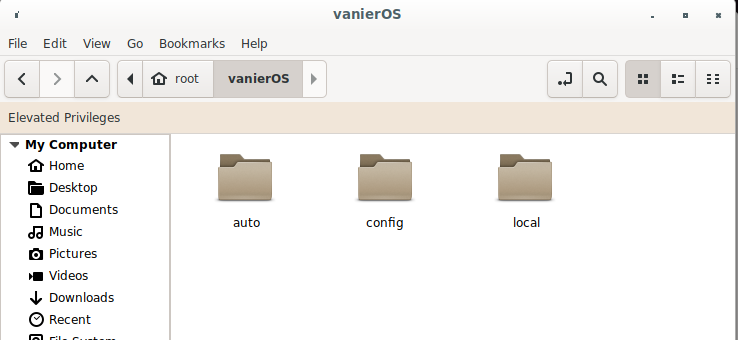  

The config folder inside vanierOS should look like this:  
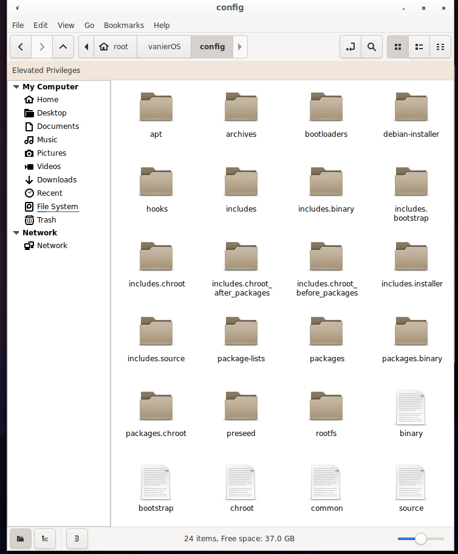  

-------------------------------------------------------
### Optional: run command below If you wish to include deb packages from misc64 folder:

If you don't have other deb packages stored in the /prep/misc64 folder, you can ignore this command.  

<code>cp $WKDIR/prep/misc64/* $WKDIR/vanierOS/config/packages.chroot/</code>

-------------------------------------------------------

### Step 7: start the build process

#Run command below to start live build:  

<code>lb build</code>  

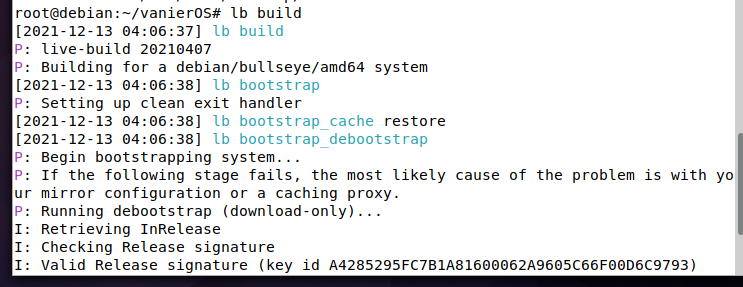  

Note:  
None of these commands will work if you are not root (either logged in as root or done <code>su -l</code> at the beginning)  

The iso image build should take a average of one hour (though this will be dependent on the amount of packages to be installed, connection speed, etc.)

-------------------------------------------------------

### Step 8: Wait for the build to complete. 

Once completed, the ISO will be located inside the build folder (vanierOS)  

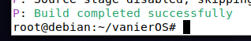  

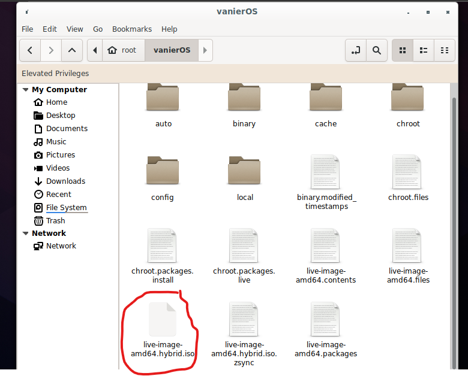  

-------------------------------------------------------

### bldeznix111-howto.txt -- Revision: 111r1 -- by eznix (https://sourceforge.net/projects/eznixos/) -> (GNU/General Public License version 3.0)

## Considerations: 

Our live system was built using Debian Live Tools and so it requires a Debian system.  
This will not work on Ubuntu or other distributions.  
If you are building your system using a virtual machine, allocate a minimum of 30GB to allow for all the folders and files needed.  
If you are adding extra stuff to what we have done here, then allocate more than 30GB to ensure proper functionality.   

These instructions were written by Giuliana Bouzon, Jiahui Xia and Chilka Castro and based on the aforementioned documentation by eznix.  

This project is licensed under the GNU/General Public License version 3.0

The ISOs we have built were uploaded to a Google Drive folder and can be downloaded and tested/used by anyone.  
Please check our install.md for information on how to do the installation process for the images (based on our latest -> build 7)  
Our images are all named the same, except for a number at the end which defines the version (the latest is the 6th version).

Link to Google Drive folder containing our ISOs: [VANIER OS TESTS](https://drive.google.com/drive/folders/1vn8E_Y-FxO9s4X-_mcH4Xkb1Z5cetZEE?usp=sharing)
