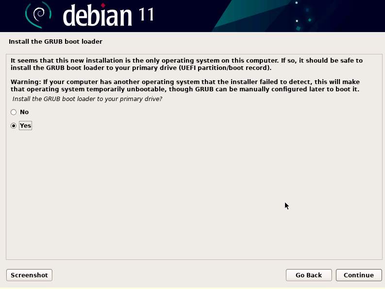

# Vanier OS Installation Guide (Graphical Installer) - version 1

### Step 1: download ISO and open it in a vm 

-------------------------------------------------------

Download the ISO from [VANIER OS TESTS](https://drive.google.com/drive/folders/1vn8E_Y-FxO9s4X-_mcH4Xkb1Z5cetZEE?usp=sharing) -> live-image-amd64.hybrid-6.iso (latest version).  

Open it in a virtual machine (for this installation guide, we are using VMWare)  

  

Choose <b>Start Installer</b> option (3)

-------------------------------------------------------

### Step 2: choose preferred language/country/keyboard settings

-------------------------------------------------------

  

  

  

For our installation, we chose English -> United States -> American English  

After choosing these settings, some installation will begin and when finished it will prompt user to enter hostname.  

  

-------------------------------------------------------

### Step 3: setting passwords and users

-------------------------------------------------------

For our installation, we chose debian -> vanierfloss  

The user will then be prompted to enter the root password (make sure you choose something you can easily remember since this will be needed to run later steps).  

  

Then, enter the name for the user.  

  

Enter a username for your account.  

  

Choose a password for the user you just created (again, choose something you can easily remember).  

  

-------------------------------------------------------

### Step 4: configure the clock

-------------------------------------------------------

For our installation, we are using <b>Eastern</b>.  

  

-------------------------------------------------------

### Step 5: configure disks as you wish & start installation

-------------------------------------------------------

We will be using the guided installation (entire disk), withh all files in one partition.  

System installation will then begin:  

  

You can then choose whether to use a network mirror or not. This is optional. 

Install GRUB boot loader to your primary drive:  

  

  

-------------------------------------------------------

### Step 6: logging in

-------------------------------------------------------

For the first login and subsequent commands, log in as root. Enter the password you chose for root in Step 3.  

  

-------------------------------------------------------

### Step 7: 

-------------------------------------------------------

-------------------------------------------------------

### Step 8:

-------------------------------------------------------

-------------------------------------------------------

